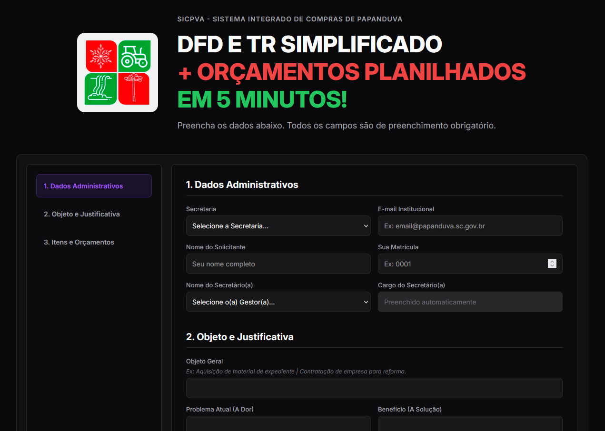
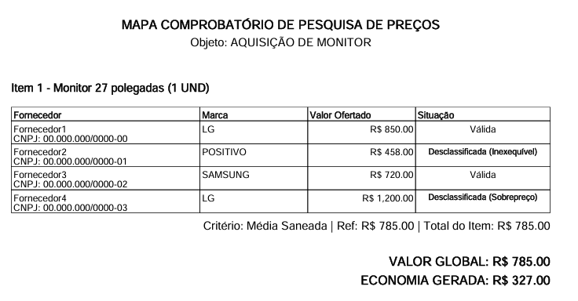
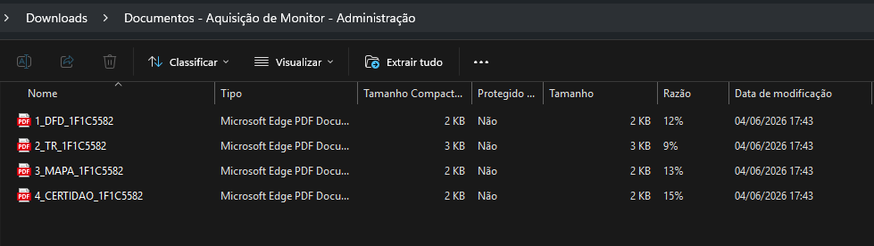

# SICPVA - Sistema Integrado de Compras de Papanduva

O **SICPVA** é uma plataforma arquitetada para automatizar e gerenciar o fluxo de compras públicas simplificadas da Prefeitura Municipal de Papanduva/SC. O sistema transforma horas de redação e formatação de documentos num processo de 5 minutos, garantindo compliance total com a Nova Lei de Licitações (Lei 14.133/2021), Lei Complementar 123/2006 (ME/EPP) e Decretos Municipais vigentes.

## Funcionalidades Principais

* **Geração Automatizada de Documentos:** Cria instantaneamente um pacote `.ZIP` contendo os PDFs do DFD (Documento de Formalização de Demanda), TR (Termo de Referência), Mapa de Preços e Certidão de Dispensa.
* **Auditor de IA Integrado (Google Gemini):** O sistema analisa o objeto da compra em tempo real. Ele corrige a ortografia, formata a justificativa em linguagem jurídica formal e **bloqueia operações ilegais** (ex: tentar usar Inexigibilidade para bens comuns).
* **Motor de Regras de Negócio (Compliance):**
  * Trava invisível para o Art. 187 (bloqueia prazos superiores a 30 dias ou valores acima do teto).
  * Painel de classificação de Preferência Local (ME/EPP).
  * Detecção automática de aquisições de T.I. para exigência de parecer técnico.
* **Interface Responsiva:** Design *Mobile First* permitindo que os servidores criem processos diretamente do telemóvel.

## 🛠️ Tecnologias Utilizadas

**Back-end:**
* **Java** + **Spring Boot** (Web API)
* **OpenPDF** (Motor de renderização dos relatórios em PDF)
* **Google Gemini 2.5 Flash API** (Processamento de Linguagem Natural e Auditoria)

**Front-end:**
* **HTML5**, **CSS3**, **Vanilla JavaScript** (Spring MVC)

**Infraestrutura & Deploy:**
* **Docker** (Conteinerização multi-stage build via `eclipse-temurin`)
* **Render** (Hospedagem em nuvem)
* **Google Sheets Webhook** (Banco de dados em nuvem para logs de emissão)

## 📸 Capturas de Tela

  
   
  <em>Interface principal com o painel de geração de documentos.</em>

  
   
  <em>Exemplo de Mapa Comprobatório de Pesquisa de Preços gerado automaticamente pelo Java.</em>

  
   
  <em>Exemplo de todos os documentos gerados no processo.</em>

